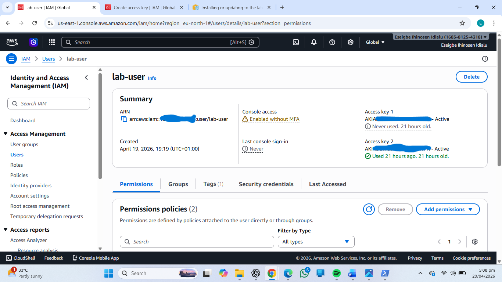
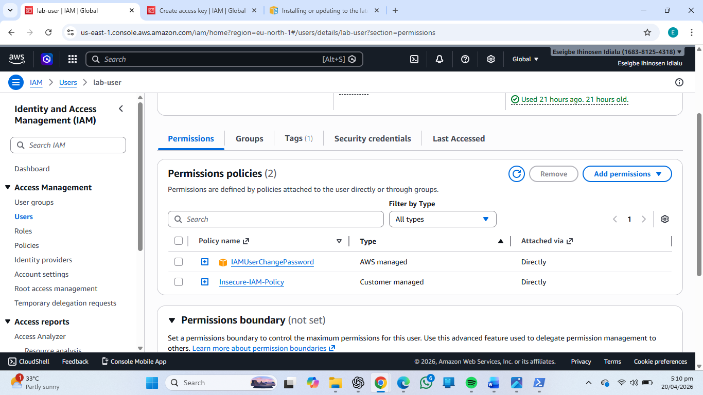
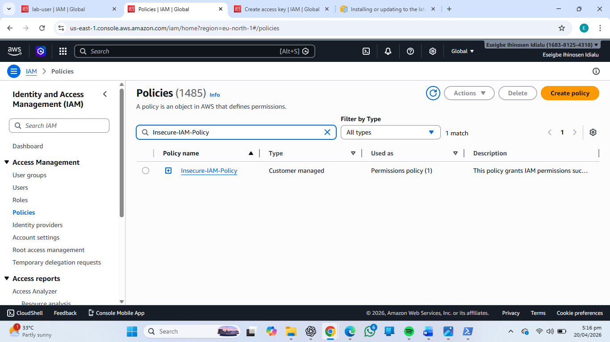
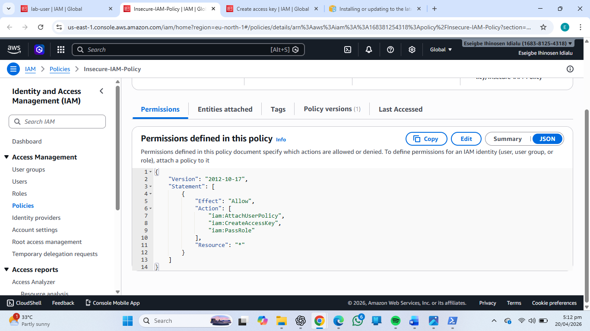
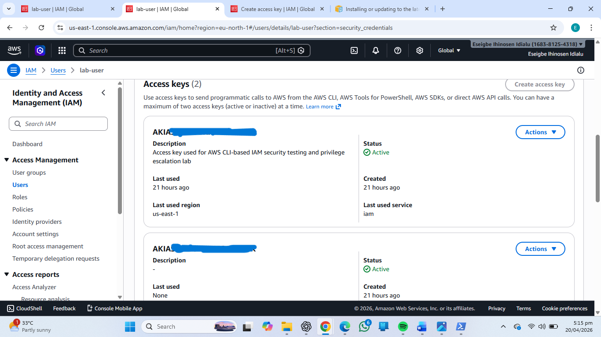
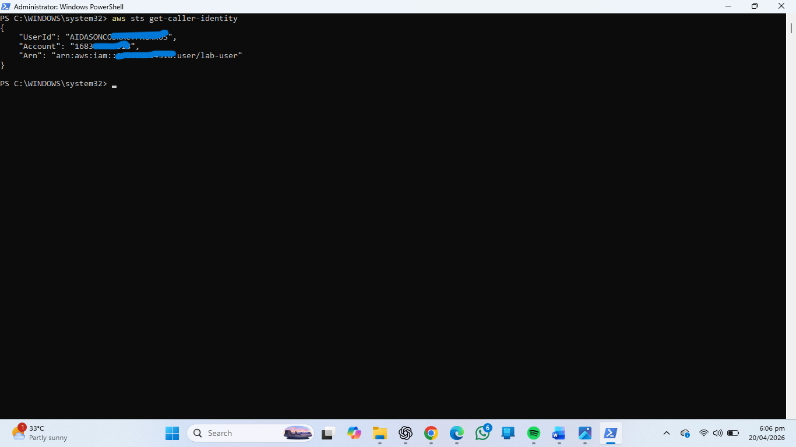
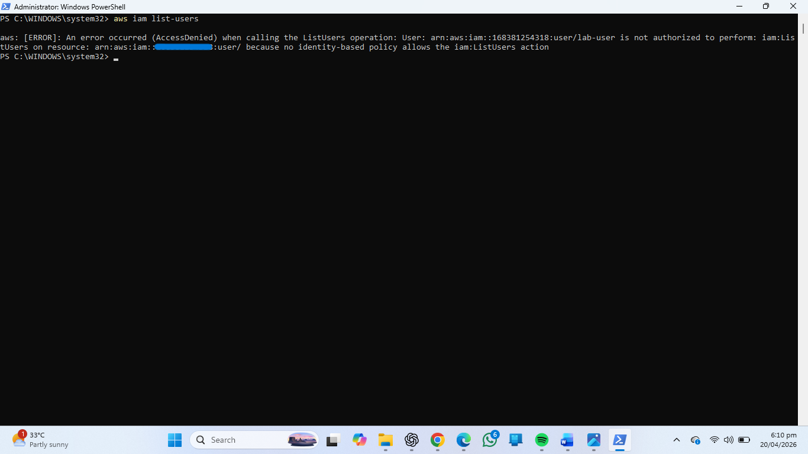
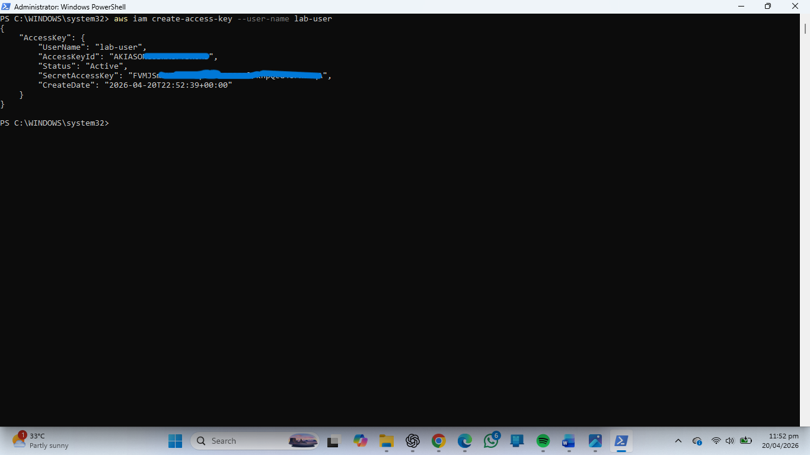

# Cloud Privilege Escalation Simulation

## Overview
This project demonstrates a simulated cloud privilege escalation scenario in Amazon Web Services (AWS) involving a misconfigured IAM policy assigned to a low-privileged user.  

The lab focuses on identifying insecure IAM permissions, demonstrating their security impact using AWS CLI, and applying remediation using the Principle of Least Privilege.

This project was created for hands-on cloud security practice and to demonstrate practical understanding of:
- AWS IAM security
- Privilege escalation risks
- Credential abuse
- IAM policy hardening
- Cloud security remediation

---

# Objectives

- Simulate IAM privilege escalation risks in AWS
- Identify insecure IAM permissions
- Demonstrate credential abuse using AWS CLI
- Analyze the security impact of excessive permissions
- Apply remediation using least privilege principles
- Validate mitigation through post-remediation testing

---

# Technologies Used

- Amazon Web Services (AWS)
- AWS IAM
- AWS CLI
- Linux Terminal
- Identity and Access Management Policies

---

# Vulnerability Description

During the simulation, an IAM user named `lab-user` was assigned a custom IAM policy called `Insecure-IAM-Policy` containing overly permissive IAM-related actions.

The policy included sensitive permissions such as:

```json
{
  "Effect": "Allow",
  "Action": [
    "iam:CreateAccessKey",
    "iam:AttachUserPolicy",
    "iam:PassRole"
  ],
  "Resource": "*"
}
```

These permissions are considered high-risk because they allow a low-privileged user to interact with IAM resources and potentially perform credential abuse or privilege escalation activities.

Using AWS CLI, the following actions were observed:

- Successful authentication using AWS credentials
- Access denied responses for IAM enumeration attempts
- Successful creation of IAM access keys
- AWS service quota enforcement limiting access key creation

---

# Security Impact

## Credential Persistence Risk

The ability to create access keys enables attackers to generate long-term credentials that can maintain persistence even if passwords are changed.

## Privilege Escalation Potential

Permissions such as:
- `iam:AttachUserPolicy`
- `iam:PassRole`

could allow attackers to escalate privileges in a more permissive environment.

## Reduced Visibility

The restricted ability to enumerate IAM resources can reduce detection visibility during malicious activity.

---

# Exploitation Simulation

The following AWS CLI actions were performed during the simulation:

## Identity Verification

```bash
aws sts get-caller-identity
```

## IAM Enumeration Attempts

```bash
aws iam list-users
aws iam get-user
```

## Access Key Creation

```bash
aws iam create-access-key --user-name lab-user
```

The simulation confirmed that the user could generate access keys despite limited IAM visibility.

---

# Screenshots

## IAM User Overview



---

## IAM Permission Tab



---

## IAM Policies Page



---

## IAM Policy Details



---

## IAM Access Keys



---

## CLI Logs - Identity Checks



---

## CLI Logs - Failed Permissions



---

## CLI Logs - Exploitation Success



---

# Remediation

The vulnerability was mitigated using the Principle of Least Privilege.

The following corrective actions were implemented:

## Policy Hardening

The following IAM permissions were removed:
- `iam:CreateAccessKey`
- `iam:AttachUserPolicy`
- `iam:PassRole`

## Permission Restriction

The IAM user was restricted to only minimal required permissions.

## Access Control Enforcement

Post-remediation testing confirmed that:
- IAM modification attempts were denied
- Access key creation failed
- Administrative actions were blocked

---

# Verification of Fix

Post-remediation AWS CLI testing confirmed successful mitigation.

## Access Key Creation Denied

```bash
aws iam create-access-key --user-name lab-user
```

Result:

```text
AccessDenied
```

This confirmed that excessive IAM permissions had been successfully removed.

---

# Security Recommendations

- Apply the Principle of Least Privilege
- Avoid assigning IAM management permissions to non-administrative users
- Monitor IAM activities using AWS CloudTrail
- Regularly audit IAM policies and access keys
- Enforce MFA for privileged accounts
- Use IAM roles instead of long-term credentials where possible

---

# Reports

## Vulnerability Report
- `reports/vulnerability_report.pdf`

## Remediation Report
- `reports/remediation_report.pdf`

---

# Skills Demonstrated

- AWS IAM Security
- Cloud Privilege Escalation Analysis
- AWS CLI Usage
- IAM Policy Analysis
- Security Misconfiguration Detection
- Principle of Least Privilege
- Security Remediation
- Cloud Security Assessment
- Technical Documentation

---

# Conclusion

This project demonstrated how excessive IAM permissions can introduce serious cloud security risks.  

The simulation showed that even limited IAM-related permissions can enable credential abuse and create opportunities for privilege escalation.

By implementing least privilege access controls and removing unnecessary IAM permissions, the environment was successfully secured and the attack surface significantly reduced.

---

# Author

Eseigbe Ihinosen